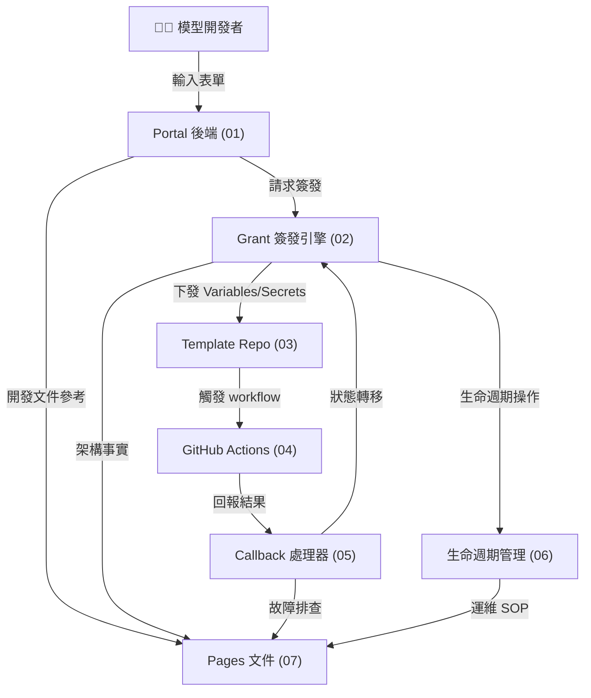

# 模型授權流程架構藍圖總覽

## 文件概述

本目錄包含**平台模型授權流程**的完整架構規劃，由 7 個獨立但相互依賴的環節組成。每個環節各自定義元件責任、公開 API、資料表映射、不變式與邊界條件。

**目標讀者**：Platform 工程團隊、RD、QE、Product Manager  
**用途**：架構設計、實作藍圖、交付驗收、跨部門溝通  
**狀態**：MVP 階段；二期升級（多版本管理、自動 rotation）未納入

---

## 環節總覽

| 序號 | 檔案 | 環節名稱 | 主責 | 核心輸出 |
|-----|------|--------|------|---------|
| 01 | `01-portal-model-onboarding.md` | Portal 模型上架入口 | Portal 後端 | Draft、config.yaml、Publish Grant 簽發入口 |
| 02 | `02-publish-grant-issuance-engine.md` | 發布憑證簽發引擎 | Platform 核心邏輯 | Publish Grant、Credential、Callback Token |
| 03 | `03-template-repo-automation.md` | 模板 Repository 自動化 | Template 工具層 | Variables/Secrets 載入、preflight 檢查 |
| 04 | `04-github-actions-validation-pipeline.md` | GitHub Actions 驗收管線 | CI/CD 層 | Image URI、Digest、OCI Labels、Callback 觸發 |
| 05 | `05-callback-processor-and-state-machine.md` | Callback 接收與狀態遷移 | Platform 事件處理 | 簽章驗証、狀態轉移、ACR artifact 驗証 |
| 06 | `06-credential-lifecycle-management.md` | 授權資源生命週期管理 | Platform 運維層 | Grant 簽發/輪替/撤銷/過期、稽核 |
| 07 | `07-documentation-and-operations-sop.md` | Pages 文件與運維指南 | 文件與培訓層 | 開發者指南、SOP、故障排查、審核清單 |

---

## 依賴關係圖



---

## 查核清單使用方式

每個 blueprint 檔案包含 **13-15 個查核點**，供以下角色使用：

- **RD**：實作前確認設計邊界（依賴方向、API contract、不變式）
- **QE**：設計測試策略（unit/integration/E2E 分層、覆蓋範圍）
- **DevOps/Maintainer**：部署與監測（環境變數、秘密管理、監測點）
- **Reviewer**：代碼審查時核對架構遵循度

**使用流程**：
1. 拉開對應環節的 blueprint 檔案
2. 逐一核對查核清單項目
3. 未完成的項目標記為待辦事項
4. 完成後簽核並紀錄日期

---

## 重要術語定義

| 術語 | 定義 | 範圍 |
|-----|------|------|
| **Publish Grant** | 一次性上架授權，含 ID、ACR path、callback token、TTL | 01-02-05-06 |
| **model_card_draft** | 開發者填寫的模型信息臨時儲存，包含 yaml export | 01-02 |
| **config.yaml** | 模型打包配置（model/deployment/license/image 章節），自動產出 | 01-03 |
| **Credential** | ACR login 用的 username/password，由 Grant 管理 | 02-06 |
| **Callback Token** | GitHub Actions 用來簽署 callback 請求的祕密，HMAC-SHA256 驗証 | 02-05 |
| **OCI Labels** | Docker image 上的元數據（model-version, grant-id 等），用於驗証 | 03-04-05 |
| **ACR Artifact** | Azure Container Registry 中的 image，包含 digest、manifest、labels | 04-05 |
| **State Machine** | 9 個狀態 + 8 個轉移規則，控制發布生命週期 | 02-05 |

---

## 使用流程總結（開發者視角）

```
1. 開發者進入 Portal → 點「新增模型」
2. Portal (01) → 填表單 → 自動產出 config.yaml
3. Portal (01-02) → 簽發 Publish Grant → 下發 GitHub Variables/Secrets
4. 開發者 → Clone template repo
5. Template repo (03) → 填充 Variables/Secrets → 執行 preflight 檢查
6. 開發者 → Push 到 GitHub
7. GitHub Actions (04) → 構建、推送 → 觸發 Callback
8. Platform (05) → 接收 callback → 驗証 → 狀態轉移
9. Platform reviewer → 檢視、審核、發布
10. Platform (06) → 資源生命週期管理（監測、輪替、撤銷）
```

---

## 查核點統計

| 環節 | 查核點數 | 主要類別 |
|-----|---------|---------|
| 01 Portal | 14 | 表單驗證、yaml 產出、秘密管理、error handling |
| 02 Grant | 14 | grant 簽發、credential mode、過期檢查、token 驗証 |
| 03 Template | 13 | preflight 檢查、yaml 讀取、環境變數、工具驗証 |
| 04 Actions | 13 | Dockerfile、digest 計算、ACR push、labels、callback |
| 05 Callback | 14 | endpoint 實作、簽章驗証、幂等性、狀態轉移、ACR 驗証 |
| 06 Lifecycle | 13 | grant 簽發/撤銷/過期、credential rotation、稽核 |
| 07 Pages | 15 | 文件涵蓋度、超連結、code snippet、架構圖 |
| **合計** | **96** | — |

---

## 如何閱讀本規劃

### 快速上手（15 分鐘）
1. 讀本 README 的「環節總覽」表
2. 掃一遍依賴關係圖
3. 選擇與您職責相關的環節檔案（例如 RD 重點看 02-05，QE 重點看 04-05）

### 深入理解（1-2 小時）
1. 從環節 01 開始依序讀完
2. 用 mermaid 工具畫出自己理解的依賴圖
3. 標記有疑問的「待確認項」（TBD），提給 PM

### 實作準備（邊做邊查）
1. 拉開對應環節檔案
2. 核對「Source of Truth」欄位指向的程式碼
3. 逐項檢視「查核清單」
4. 未完成的項目開 issue 或 PR

---

## 檔案修改歷史

| 日期 | 版本 | 作者 | 異動摘要 |
|-----|------|------|---------|
| 2026-06-29 | 0.1 | Architecture RD | 初版發布；7 個環節完整架構藍圖 |
| 2026-06-29 | 0.2 | Product Strategy Manager | 發布 CEO 決策凍結版，啟動 RD/QE 實作與驗收 |

---

## 決策凍結版（PM 發布）

本節為 PM 依 CEO 指示發布的「凍結決策」，即日起作為 MVP 執行基準。未經 CEO 新裁決，不得回退或擴張範圍。

### 已凍結決策（全部已解完）

1. 稽核紀錄保留 1 年。
2. 稽核紀錄允許平台維運工程師手動刪除。
3. 刪除行為本身不可刪，必須保留可追蹤紀錄。
4. 開發者流程公開於 Pages；維運細節放在 Repository 文件，並由 README 導引。
5. 文件主要語言為繁體中文，寫作風格參照 Azure Learn 中文文件。
6. MVP 採基本安全；進階反破譯（含 .so compile 強化）移至下一階段。
7. 季授權只套用部署授權金鑰（供部署者運行容器），不套用發布流程金鑰。
8. 舊金鑰輪替不保留緩衝，立即失效。

### 影響範圍與約束

- 影響文件：01、02、04、06、07。
- 影響實作：金鑰語意切分、稽核刪除軌跡、文件公開邊界、MVP 安全範圍。
- 約束：不得在 MVP 宣稱已提供 .so 反破譯強化。

---

## RD 進入實作（立即生效）

### RD 組長（architecture-research-developer）

1. 在 `06-credential-lifecycle-management.md` 將「稽核日誌不可刪除」修訂為「主紀錄可刪除，但刪除事件不可刪除」。
2. 在 `01-portal-model-onboarding.md` 與 `02-publish-grant-issuance-engine.md` 明確切分：
    - 發布流程金鑰（上架流程用）
    - 部署授權金鑰（季授權）
3. 在 `04-github-actions-validation-pipeline.md` 註記進階反破譯為下一階段，避免 MVP 超額承諾。

### RD 實作者（senior-software-engineer）

1. 實作舊金鑰立即失效路徑：
    - 失效後任何部署授權驗證均拒絕。
    - API 回應附可操作訊息（請回 Portal 重新申請）。
2. 實作稽核刪除事件追蹤：
    - 記錄誰刪除、何時刪除、刪除原因、刪除對象識別。
    - 追蹤事件不可再刪除。
3. 將季授權邏輯僅綁定部署授權金鑰，不影響發布流程金鑰。

### RD 演算法/安全（algorithm-research-developer）

1. 檢查基本加解密與簽章驗證路徑在 MVP 是否一致且可解釋。
2. 產出下一階段反破譯技術備忘錄（不進入本期實作）。

---

## QE 進入驗收（RD 提交後立即啟動）

### QE 組長（testing-quality-engineer）

1. 建立 P0 驗收案例：
    - 過期部署授權金鑰拒絕。
    - 部署者可在 Portal 重申請並成功恢復部署。
    - 舊金鑰立即失效且不可用。
2. 建立稽核刪除案例：
    - 主紀錄可刪除。
    - 刪除事件可查且不可刪除。
3. 建立文件邊界案例：
    - Pages 僅暴露開發者流程。
    - 維運細節僅在 Repository 文件可見。
4. 建立承諾一致性案例：
    - MVP 文件不得宣稱已提供 .so 反破譯強化。

### 驗收 Gate（不得放寬）

- Gate A（授權可用性）：季授權過期、重申請、立即失效三路徑全通過。
- Gate B（稽核可追溯）：主紀錄可刪除但刪除事件不可刪除且可查詢。
- Gate C（文件邊界）：公開內容與內部內容分層正確。
- Gate D（對外承諾）：文件與實作能力一致。

---

## 責任分派與交付時間

| 部門 | 責任人 | 本輪交付物 | 狀態 |
|-----|--------|-----------|------|
| PM | product-strategy-manager | 決策凍結版發布與範圍凍結 | 已發布 |
| RD | architecture-research-developer | 藍圖修訂與依賴/語意切分 | 進行中 |
| RD | senior-software-engineer | 功能實作（立即失效、重申請、刪除追蹤） | 待啟動 |
| RD | algorithm-research-developer | MVP 安全一致性檢查 + 下一階段備忘錄 | 待啟動 |
| QE | testing-quality-engineer | P0 驗收、Gate A-D 測試報告 | 待啟動 |

---

## 完成定義（DoD）

1. RD 完成藍圖修訂並與程式碼一致。
2. QE Gate A-D 全數通過。
3. 文件公開邊界與實際部署內容一致。
4. MVP 對外聲明未超出已實作能力。

---

## 相關資源連結

**GitHub 倉庫**：
- [utils/routes/model_card_publish_routes.py](../../../utils/routes/model_card_publish_routes.py) — Portal API
- [utils/model_card/publishing.py](../../../utils/model_card/publishing.py) — 核心邏輯
- [utils/db.py](../../../utils/db.py) — 資料表架構
- [model-card-package-template/](../../../model-card-package-template/) — 模板

**Pages 文件**：
- [docs/platform/advanced/](../../../docs/platform/advanced/) — 平台架構
- [docs/model-provider/](../../../docs/model-provider/) — 開發者指南

**待更新的文件**（由 07 環節負責）：
- `docs/platform/advanced/authorization-and-access.md` — 授權模型
- `docs/platform/advanced/model-card-publishing.md` — 發布流程
- `docs/platform/advanced/operations-runbook.md` — 運維 SOP

---

## 聯絡與回饋

有任何疑問或需要調整規劃？

1. 檢查對應環節檔案的「待確認項」（TBD）
2. 提交 GitHub Issue（標籤：`blueprint`, `architecture`）
3. 聯繫 Product Manager（規劃邊界）或 Architecture RD（技術細節）

---

**最後更新**：2026-06-29  
**狀態**：MVP 架構 + 實作準備；二期功能（多版本、自動 rotation）納入時需更新
