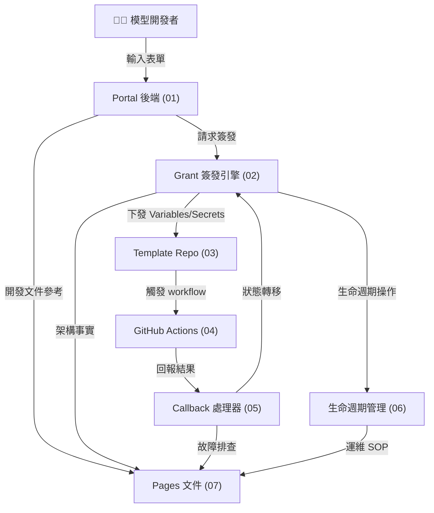

# 模型授權流程架構藍圖總覽

本檔只做 blueprint 索引與閱讀導航，不承擔凍結決策、施工工單或驗收結論。那些內容應回各環節 blueprint、對應 instruction，或另立 decision log。

**目標讀者**：Platform 工程團隊、RD、QE、PM  
**用途**：知道有哪些 blueprint、它們彼此怎麼依賴、該從哪一份開始看

---

## Blueprint 必備結構（強制）

自本版起，每一份環節 blueprint 必須包含以下四段，順序不可顛倒：

1. `啟動`：目標、前置條件、邊界與凍結決策。
2. `規劃`：元件責任邊界、依賴方向、資料流與約束。
3. `執行（真的要施工的細部規格）`：可直接實作的 API、資料表、狀態機、不變式與錯誤碼。
4. `交付驗收（查核點 Checklist）`：可簽核的驗收清單與 checked 規範。

Checklist 格式規範：

- Checklist 一律使用表格，不再使用 Markdown checkbox。
- 每個查核點都必須是一列，且至少包含欄位：`查核點 | 完成條件 | Checked | 證據 | 備註 | 規劃簽核 | 施工簽核 | 測試簽核`。
- `Checked` 可接受值需在每份文件明確定義（建議 `Y/N/N/A`）。
- 三方簽核必須逐查核點填寫，不可改為整份文件一次簽核。

---

## 四階段與三份 SOP 指南

本專案的四個階段仍是 `啟動`、`規劃`、`執行`、`交付驗收`，但詳細規範不再集中在此檔，而是拆成三份獨立 instruction 檔，避免在任一 blueprint 內把三段流程一起載入。

| 階段 | 主要用途 | 應參考的 instruction |
|-----|---------|-------------------|
| 開始 | 問題定義、範圍、凍結前提 | `.github/instructions/start-to-planning.instructions.md` |
| 規劃 | blueprint package、查核點、交接 | `.github/instructions/start-to-planning.instructions.md` |
| 執行 | work orders、施工簽核、偏差回寫 | `.github/instructions/planning-to-execution.instructions.md` |
| 驗證 | 驗收證據、blocking gate、回寫 | `.github/instructions/execution-to-verification.instructions.md` |

### 文件分工

- `instructions/cross-team.instructions.md`：只放共通協作原則與 SOP 索引。
- `instructions/start-to-planning.instructions.md`：只放開始 → 規劃。
- `instructions/planning-to-execution.instructions.md`：只放規劃 → 執行。
- `instructions/execution-to-verification.instructions.md`：只放執行 → 驗證。
- `blueprint/[01-07].md`：各自的 blueprint 詳細內容。

---

## 環節總覽

| 序號 | 檔案 | 環節名稱 | 主責 | 核心輸出 |
|-----|------|--------|------|---------|
| 01 | `01-portal-model-onboarding.md` | Portal 模型上架入口 | Portal 後端 | Draft、config.yaml、Publish Grant 簽發入口 |
| 02 | `02-publish-grant-issuance-engine.md` | 發布憑證簽發引擎 | Platform 核心邏輯 | Publish Grant、Credential、Callback Token |
| 03 | `03-template-repo-automation.md` | 模板 Repository 自動化 | Template 工具層 | Variables/Secrets 載入、preflight 檢查 |
| 04 | `04-github-actions-validation-pipeline.md` | GitHub Actions 驗收管線 | CI/CD 層 | Image URI、Digest、OCI Labels、Callback 觸發 |
| 05 | `05-callback-processor-and-state-machine.md` | Callback 接收與狀態遷移 | Platform 事件處理 | 簽章驗証、狀態轉移、ACR artifact 驗証 |
| 06 | `06-credential-lifecycle-management.md` | 授權資源生命週期管理 | Platform 運維層 | Grant 簽發/輪替/撤銷/過期、稽核 |
| 07 | `07-documentation-and-operations-sop.md` | Pages 文件與運維指南 | 文件與培訓層 | 開發者指南、SOP、故障排查、審核清單 |

---

## 依賴關係圖



---

## 查核清單使用方式

每個 blueprint 檔案包含 **13-15 個查核點**，供以下角色使用：

- **RD**：實作前確認設計邊界（依賴方向、API contract、不變式）
- **QE**：設計測試策略（unit/integration/E2E 分層、覆蓋範圍）
- **DevOps/Maintainer**：部署與監測（環境變數、秘密管理、監測點）
- **Reviewer**：代碼審查時核對架構遵循度

**使用流程**：
1. 拉開對應環節的 blueprint 檔案
2. 逐一核對查核清單項目
3. 未完成的項目標記為待辦事項
4. 完成後簽核並紀錄日期

---

## 重要術語定義

| 術語 | 定義 | 範圍 |
|-----|------|------|
| **Publish Grant** | 一次性上架授權，含 ID、ACR path、callback token、TTL | 01-02-05-06 |
| **model_card_draft** | 開發者填寫的模型信息臨時儲存，包含 yaml export | 01-02 |
| **config.yaml** | 模型打包配置（model/deployment/license/image 章節），自動產出 | 01-03 |
| **Credential** | ACR login 用的 username/password，由 Grant 管理 | 02-06 |
| **Callback Token** | GitHub Actions 用來簽署 callback 請求的祕密，HMAC-SHA256 驗証 | 02-05 |
| **OCI Labels** | Docker image 上的元數據（model-version, grant-id 等），用於驗証 | 03-04-05 |
| **ACR Artifact** | Azure Container Registry 中的 image，包含 digest、manifest、labels | 04-05 |
| **State Machine** | 9 個狀態 + 8 個轉移規則，控制發布生命週期 | 02-05 |

---

## 使用流程總結（開發者視角）

```
1. 開發者進入 Portal → 點「新增模型」
2. Portal (01) → 填表單 → 自動產出 config.yaml
3. Portal (01-02) → 簽發 Publish Grant → 下發 GitHub Variables/Secrets
4. 開發者 → Clone template repo
5. Template repo (03) → 填充 Variables/Secrets → 執行 preflight 檢查
6. 開發者 → Push 到 GitHub
7. GitHub Actions (04) → 構建、推送 → 觸發 Callback
8. Platform (05) → 接收 callback → 驗証 → 狀態轉移
9. Platform reviewer → 檢視、審核、發布
10. Platform (06) → 資源生命週期管理（監測、輪替、撤銷）
```

---

## 查核點統計

| 環節 | 查核點數 | 主要類別 |
|-----|---------|---------|
| 01 Portal | 14 | 表單驗證、yaml 產出、秘密管理、error handling |
| 02 Grant | 14 | grant 簽發、credential mode、過期檢查、token 驗証 |
| 03 Template | 13 | preflight 檢查、yaml 讀取、環境變數、工具驗証 |
| 04 Actions | 13 | Dockerfile、digest 計算、ACR push、labels、callback |
| 05 Callback | 14 | endpoint 實作、簽章驗証、幂等性、狀態轉移、ACR 驗証 |
| 06 Lifecycle | 13 | grant 簽發/撤銷/過期、credential rotation、稽核 |
| 07 Pages | 15 | 文件涵蓋度、超連結、code snippet、架構圖 |
| **合計** | **96** | — |

---

## 如何閱讀本規劃

### 快速上手（15 分鐘）
1. 讀本 README 的「環節總覽」表
2. 掃一遍依賴關係圖
3. 選擇與您職責相關的環節檔案（例如 RD 重點看 02-05，QE 重點看 04-05）

### 深入理解（1-2 小時）
1. 從環節 01 開始依序讀完
2. 用 mermaid 工具畫出自己理解的依賴圖
3. 標記有疑問的「待確認項」（TBD），提給 PM

### 實作準備（邊做邊查）
1. 拉開對應環節檔案
2. 核對「Source of Truth」欄位指向的程式碼
3. 逐項檢視「查核清單」
4. 未完成的項目開 issue 或 PR

---

## 相關資源連結

**GitHub 倉庫**：
- [utils/routes/model_card_publish_routes.py](../../../utils/routes/model_card_publish_routes.py) — Portal API
- [utils/model_card/publishing.py](../../../utils/model_card/publishing.py) — 核心邏輯
- [utils/db.py](../../../utils/db.py) — 資料表架構
- [model-card-package-template/](../../../model-card-package-template/) — 模板

**Pages 文件**：
- [docs/platform/advanced/](../../../docs/platform/advanced/) — 平台架構
- [docs/model-provider/](../../../docs/model-provider/) — 開發者指南

**待更新的文件**（由 07 環節負責）：
- `docs/platform/advanced/authorization-and-access.md` — 授權模型
- `docs/platform/advanced/model-card-publishing.md` — 發布流程
- `docs/platform/advanced/operations-runbook.md` — 運維 SOP

---

## 聯絡與回饋

有任何疑問或需要調整規劃？

1. 檢查對應環節檔案的「待確認項」（TBD）
2. 提交 GitHub Issue（標籤：`blueprint`, `architecture`）
3. 聯繫 Product Manager（規劃邊界）或 Architecture RD（技術細節）

---

**最後更新**：2026-06-29  
**狀態**：Blueprint 索引與閱讀導航
