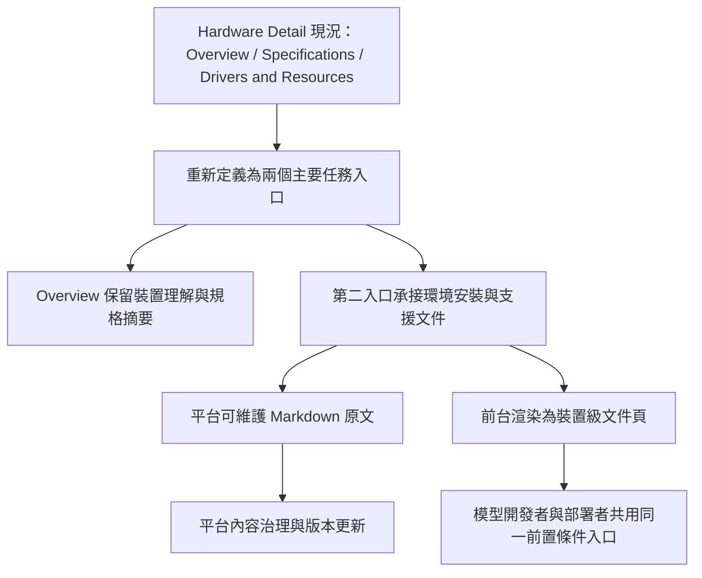

# Hardware Environment Support Page Initiative Manifest

## Initiative

- Feature Name: `hardware-environment-support-page`
- Date: `2026-06-30`
- Initiative Owner: `product-strategy-manager`
- Current Stage: `SOP3 驗證完成，詳見對應 workorder`
- Planned Workorder File: `2026-06-30-hardware-environment-support-page-markdown-content-governance-workorder.md`

## CEO 計畫架構圖（PM Formalized）

## Problem Statement

hardware detail 頁目前把真正影響部署成功率的系統前置條件降格為外部 link 卡片。模型開發者與部署者在開始本機驗證、Docker 部署或模型上架前，沒有平台內一致的裝置級環境準備入口，導致宿主機環境容易不一致，進一步造成部署失敗、驗證結果偏差與支援成本升高。

## Target User / Stakeholder

| 角色 | 需要完成的事 | 承擔成本 |
| --- | --- | --- |
| 模型開發者 | 在開發與上架前確認正確系統軟體、版本與安裝順序 | 用錯環境造成驗證失真 |
| 部署者 | 在部署前完成宿主機前置準備 | Docker / runtime 啟不來 |
| 平台內容維護者 | 持續維護各裝置支援文件 | 知識散落、更新成本高 |
| FAE / 平台營運 | 對外回應裝置安裝前提與支援入口 | 重複支援成本與錯誤導流 |

## Acceptance Criteria

1. hardware detail 的主要任務入口收斂為兩個，而不是三個平行 tab。
2. 第二入口正式命名為 `環境安裝與支援`，並定位為裝置級環境安裝 / 支援文件，而不是單純 resource links。
3. 平台正式承擔「後台可維護 Markdown 原文、前台可閱讀渲染」的產品要求。
4. 已完成的舊議題不再混入此次 initiative 分項。
5. RD / QE 能直接依本 manifest 與分項檔開工，不需再從對話回推需求。

## Expected Benefits

1. 把真正影響部署成功率的環境前置準備從次要資源卡片提升為主要入口，降低模型開發者與部署者的找路成本。
2. 建立平台內一致的裝置級支援文件入口，減少因宿主機環境不一致造成的部署失敗、驗證偏差與重複支援成本。
3. 讓內容維護、前台導覽與後續驗收都以同一套命名與資訊架構對齊，降低跨 PM、RD、QE 的返工。

## Out Of Scope

1. 不決定資料表、API、編輯器框架、Markdown parser、權限實作。
2. 不承諾自動環境檢測、驅動自修復或原廠技術支援替代。
3. 不把既有 `/guide`、Pages 文案整理、模型憑證文件整理重新納入施工。

## Overengineering Guardrail

1. 不為未被驗證的多內容型別、版本分支、草稿審批流先加抽象。
2. 不把這次需求擴張成完整知識庫平台或 CMS 重做。
3. 不在 SOP1 就預留跨裝置複雜繼承模型、可插拔渲染器或多通道發布系統。

## 已完成且不再列入本 Initiative 的項目

1. `/guide` 模型清單改版與 ACR / 系統欄位整理。
2. `/guide` 排版溢出修正。
3. Pages `規劃中` 移除與 `模型憑證與授權` 導覽重整。
4. `平台維運` 下重複 credential 頁面移位與總覽文案校正。

## Subitem Index

| Subitem | File | Owner | Delivery Form | Planned Workorder File |
| --- | --- | --- | --- | --- |
| IA and naming freeze | `2026-06-30-information-architecture-and-naming.md` | PM / UI-UX | 命名、導覽定位、使用者入口凍結 | `TBD` |
| Markdown content governance | `2026-06-30-markdown-content-governance.md` | PM / RD / FAE | 文件治理邊界、內容角色、平台責任凍結 | `2026-06-30-hardware-environment-support-page-markdown-content-governance-workorder.md` |
| Implementation start gate | `2026-06-30-implementation-start-gates.md` | PM / RD / QE | 開工前 blocking gate 與驗收入口凍結 | `TBD` |

## 規劃凍結線

1. 第二入口正式名稱凍結為 `環境安裝與支援`，`支援與合作` 不再作為本輪名稱選項。
2. `Specifications` 不再作為獨立主要任務 tab；規格資訊需回收至 `Overview` 脈絡。
3. 第二入口必須承載平台維護文件，不可退回單純外部 link cards。
4. 此輪只凍結 What / Why / Gate，不向下指定 How。

## Go / No-Go For SOP2

| Gate | 判定 |
| --- | --- |
| 分項檔已齊備 | Ready |
| 查核點表已補齊 | Ready |
| 已完成項目已從分項範圍排除 | Ready |
| 可直接交棒 RD / QE | Ready |

## SOP2 Execution Evidence

1. Hardware detail 主入口已收斂為 `Overview` 與 `環境安裝與支援`，`Specifications` 已回收在 Overview 區塊內，未刪除內容。
2. 平台已落地裝置級 Markdown 原文維護與前台渲染：`utils/hardware/markdown_support.py`、`utils/hardware/__init__.py`、`templates/pages/hardware/detail.html`、`static/js/hardware-detail.js`。
3. 文件與測試已同步更新：`docs/platform/uxui_architecture.md`、`tests/test_hardware_products.py`、`tests/test_solution_template.py`。
4. focused validation 已通過：`python -m pytest tests/test_hardware_products.py tests/test_solution_template.py -q` → `72 passed`.
