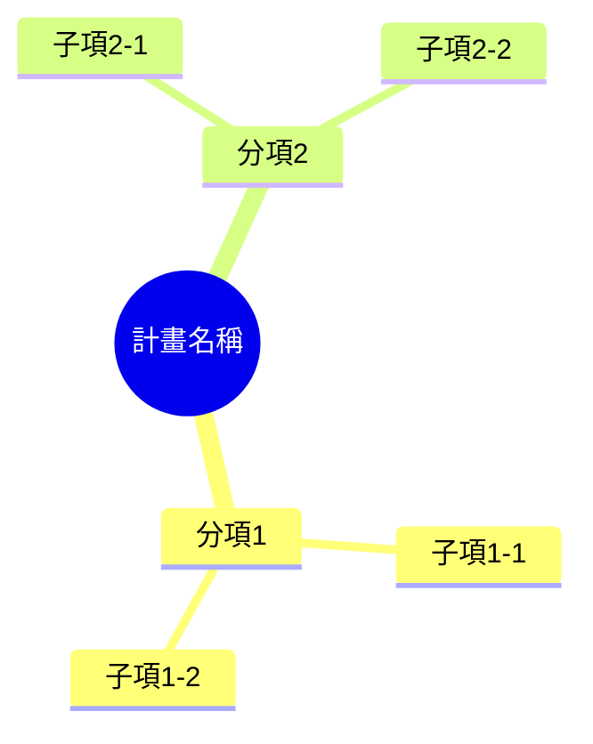
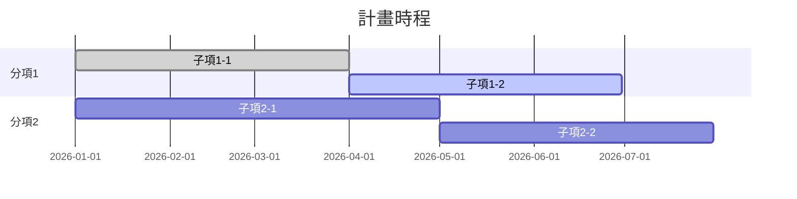

# 計劃書圖表段落格式

這三段——計畫架構、計畫時程、查核點——都有具體的圖表或表格語法規則，篇幅比敘述段落大，跟 `proposal-format.instructions.md` 分開放。三段內容環環相扣：時程依架構圖的分項子項編列，查核點依時程的完成時間填入。

## 計畫架構與實施方法

用 Mermaid `mindmap` 畫一張樹狀圖：根節點是計畫名稱，往下展開 2～3 個分項，每個分項底下再展開 2～3 個子項。分項與子項的命名要跟後面「計畫時程」「查核點」段落用的名稱完全一致，三段才能互相對照。

架構圖之後，逐一分項說明實施方法：這個分項要做什麼、依賴哪些子項完成、由誰負責。

## 計畫時程

用 Mermaid `gantt` 畫時程圖，`section` 對應架構圖的分項，每個 section 底下的任務對應該分項的子項；子項名稱與時間跟查核點表格要能互相對照。

## 查核點

每個分項——不管查核點實際落在哪個子項目——每年固定設 4 個查核點。用 Markdown 表格整理：

| 分項／子項名稱 | 預定完成時間 | 查核點內容 |
| --- | --- | --- |
| 分項1／子項1-1 | 2026-03-31 | 技術指標：完成原型驗證，達到目標準確率。 |
| 分項1／子項1-2 | 2026-06-30 | 產品規格：完成第一版功能規格書。 |
| 分項1／子項1-2 | 2026-09-30 | 品質指標：通過內部測試，缺陷數低於門檻。 |
| 分項1／子項1-2 | 2026-12-31 | 市場測試指標：完成小規模試點，取得使用者回饋。 |

查核點內容欄一律標明屬於技術指標、產品規格、品質指標、市場測試指標其中一種，並附上這個查核點具體要達到什麼條件才算通過。
