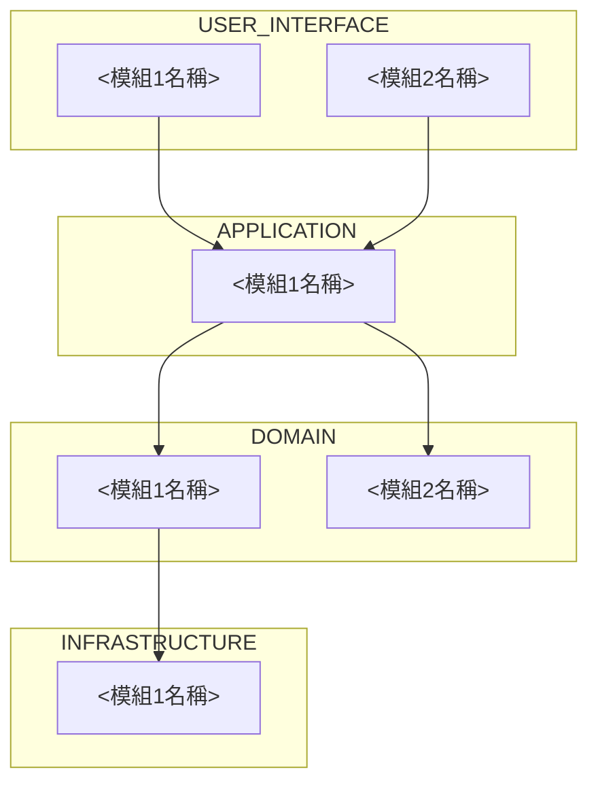

# 系統架構與模組規格撰寫規範

規格書分三部分：系統架構交代整個專案的技術總覽，模組規格交代單一模組的細節，使用範例／驗收標準交代單一使用者操作流程的驗收條件。三部分都寫進 `<專案資料夾>/.github/specs/**`，格式定義在這份檔案裡。

## 系統架構

整個專案固定一份 `<專案資料夾>/.github/specs/overview.md`，記錄這個專案的系統架構。系統架構採用領域驅動設計（DDD）分層，固定四層：使用者介面層、應用層、領域層、基礎設施層。寫成的樣子，參照下列範本：

````markdown
# 系統架構

<開場段落，交代目標使用者，只寫一次：是誰（具體的角色或客群，不是空泛的「使用者」，例如「門市 1～3 家規模的餐飲店長」，不是「中小企業主」）、要完成什麼（這個目標後續會對應到「使用範例／驗收標準」要驗證的使用者旅程）、使用情境的限制（裝置、環境、技術熟悉度等會影響介面設計與測試涵蓋範圍的限制條件）。整個系統的模組與跨層引用關係，如下圖。>



<讀圖指引：由上而下依序是使用者介面層、應用層、領域層、基礎設施層；箭頭方向就是引用方向，只能上層指向下層；每個節點的實際用途與互動細節，見下方對應層級的段落。>

## 使用者介面層

<用文字段落交代這層：主要使用的技術堆疊、參考或依附的 Benchmark 開源專案庫與為什麼參考、這層服務的對象（架構內部誰服務誰的關係，不是整個系統的目標使用者）、每個模組的用途與跨層互動關係。模組名稱第一次出現時用粗體標示並附連結指到該模組的規格位置。例如：「這層主要採用 <技術堆疊>，參考 <Benchmark 專案> 的做法，因為 <理由>；服務對象是 <這層的服務對象>。**[UI_module1](連結)** 負責<實際做什麼>，對應<存在原因>；因為<為什麼需要>，呼叫下層的 **APP_module1** 取得<資料或控制流向>。**[UI_module2](連結)** 負責<實際做什麼>，同樣依賴 **APP_module1** 的<能力>。這層明確不處理<明確排除的範圍>。」段落結構比照學術論文寫作的嚴謹度：主旨句在前，細節逐步展開，一段一主題。>

## 應用層

（寫法同上）

## 領域層

（寫法同上）

## 基礎設施層

（寫法同上）
````

模組數量、引用邊數量依實際盤點結果增減；四個層級段落固定都要出現，即使某層這次沒有模組也保留段落，寫「目前沒有模組」。第一次建立、或任一層新增／刪除模組時，由 `plan` 負責回來更新。

範本各段落依下列規則填入：

### 目標使用者

只寫一次：

1. **是誰**：具體的角色或客群，不是空泛的「使用者」（例如「門市 1～3 家規模的餐飲店長」，不是「中小企業主」）。
2. **要完成什麼**：使用這個系統的主要目標；這個目標後續會對應到下方「使用範例／驗收標準」段落要驗證的使用者旅程。
3. **使用情境的限制**：裝置、環境、技術熟悉度等會影響介面設計與測試涵蓋範圍的限制條件。

### 模組依賴關係圖

用 Mermaid `graph` 呈現，固定四個 subgraph，依上層到下層排列。節點 ID 固定用「層級縮寫_模組序號」命名（`UI_`／`APP_`／`DOM_`／`INFRA_` 四種前綴），前綴是必要做法：Mermaid 的節點 ID 在整張圖是全域的，兩個 subgraph 各自宣告一個同名節點會被當成同一個節點；加上層級縮寫前綴，才能讓不同層的同名模組畫成兩個獨立節點。跨層的引用邊只能從上層節點指向下層節點（使用者介面層→應用層→領域層←基礎設施層，依 `code-build.instructions.md` 的「依賴方向」）。模組數量、引用邊數量依「模組拆分粒度」（見下）判斷後的實際結果增減，不限於範本畫的數量。圖前面的段落要點出「如下圖」，圖後面接一段讀圖指引，交代讀這張圖時先看什麼、再看什麼——跟「模組規格」的「How 欄位的骨架」對圖的要求一致。

### 每一層的內容

用文字段落交代，不是條列式的欄位，依下列規則寫：

- 內容涵蓋：這層主要使用的技術堆疊、參考或依附的 Benchmark 開源專案庫與為什麼參考、這層服務的對象（架構內部誰服務誰的關係，不是整個系統的目標使用者）；以及這層每個模組——對應構想裡的哪個需求（存在原因）、具體到有輸入、處理、輸出的實際作為（比職稱式名詞更具體，例如寫「接收使用者送出的購物車內容，驗證庫存與價格後建立訂單記錄」，不是「訂單管理」）、明確排除的範圍。
- 牽涉跨層依賴時，由需要對方能力的那一層說明為什麼需要、資料或控制流向、什麼情境會用到；被依賴的那一層不重複這段關係，只交代自己模組的用途。
- 每個模組名稱第一次在段落中出現時用粗體標示，並附連結指到該模組的規格位置。
- 段落結構：每段有明確的主旨句，帶出這段要交代的內容，後續句子逐步展開細節；一段只圍繞一個主題，不同主題分段落。

### 模組拆分粒度

判斷兩個候選模組要不要拆開或合併，用 Who／What 兩個判準——一個候選模組裡有兩件不相關的職責，或這兩件事需要不同的人各自核准變更，要拆開；兩個候選模組的 What 高度重疊、Who 相同，且其中一個幾乎不會被其他模組單獨引用，要合併。模組數量依實際盤點結果決定；同一層在不同專案裡，合理的模組數量本來就會不同。

## 模組規格

模組規格交代單一模組的細節。

### 目錄結構

每個專案第一次使用 `plan` 時，先跟使用者盤點這個專案預期會有哪些模組，再從下列兩種目錄結構讓使用者選一種：

- 一層一檔：`<專案資料夾>/.github/specs/<layer>.md`，同一層的所有模組共用一份檔案，各佔一段。
- 一模組一檔：`<專案資料夾>/.github/specs/<layer>/<module>.md`，每個模組獨立一份檔案。

### 模組規格欄位

不管哪一種目錄結構，每個模組固定四個欄位：

```markdown
## <模組或功能名稱>

- Who：負責維護與變更核准者
- What：這個模組負責什麼；明確排除項
- How：（見下方「How 欄位的骨架」）
- Where：檔案路徑、命名慣例
```

#### How 欄位的骨架

How 欄位不是一句話，依下列骨架展開：

1. **開場定位**：這個模組的 How 要幫誰查什麼——誰會在什麼情境下需要查這一段，查完應該能判斷什麼。
2. **依賴關係與對外介面**：這個模組依賴誰、被誰依賴、對外提供什麼方法或介面。
3. **選一張圖，圖後接讀圖指引**：依這個模組的內容性質挑合適的圖，不是每個模組都用同一種：
   - 資料實體與欄位關聯 → `erDiagram`（欄位標 PK/FK）
   - 跨模組／跨層互動順序 → `sequenceDiagram`
   - 處理邏輯或決策流程 → `flowchart`
   - 部署或資源拓撲 → `block-beta`
   圖後接一段「讀這張圖時，先看什麼、再看什麼」的讀圖指引。
4. **逐一深入每個對外行為或子功能**：這個行為的來龍去脈 → 一張圖 → 讀圖指引 → 一張表格，欄位依內容性質決定（例如資料欄位用「欄位｜來源｜用途」，對外服務介面用「方法或事件｜位置｜處理內容｜輸出結果」）。有實際協定或格式的內容（API、設定檔、訊息格式）直接給具體範例。
5. **不變式與邊界條件**：任何狀態下必須成立的約束、合法輸入範圍、例外處理策略。
6. **完成條件**：這個模組的 How 交代完後，讀者應該能確認的幾件事，寫成可查核的清單。

模組還沒有這些內容時，呼叫 `/plan` 建立；已有時，`code-build.instructions.md` 的 Implementation SOP 直接讀取使用。

## 使用範例／驗收標準

整個專案的每一條使用者操作流程，固定一份 `<專案資料夾>/.github/specs/usage-examples/<flow-name>.md`，記錄這條流程的驗收標準。寫成的樣子，參照下列範本：

````markdown
# <流程名稱>

## 情境／角色

<使用者是誰、想完成什麼目標>

## 前置條件

<系統狀態、需要的帳號或資料>

## 步驟

| # | 操作 | 預期結果 |
|---|------|---------|
| 1 | <...> | <...> |
````

這份文件只記錄驗收標準；實際執行與記錄結果，交給 `test` 技能寫進 `<專案資料夾>/tests/operations/<flow-name>.md`，格式定義在 `operations-test.instructions.md`，不在這裡重複。
