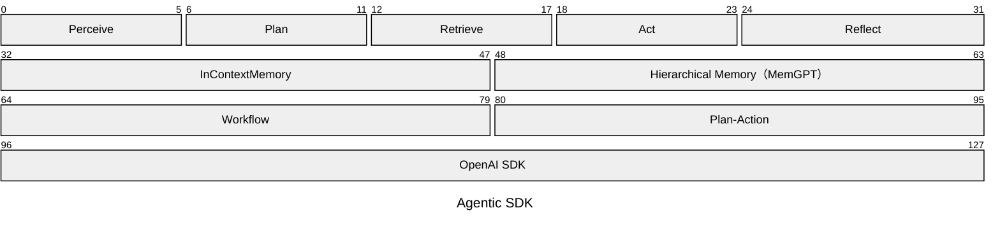
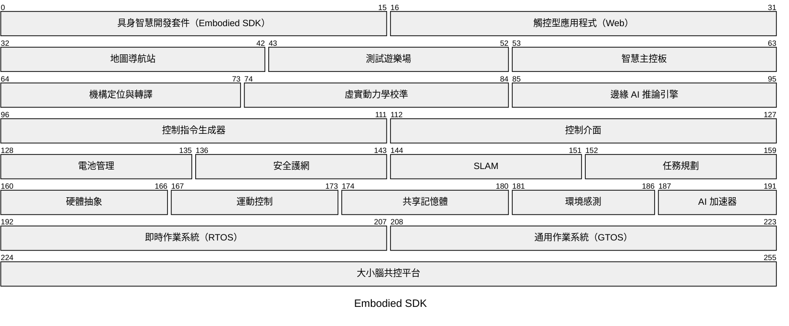

# Markov Chen

歡迎來到我的 GitHub 個人頁面。

## Agentic SDK

Since 2023, AI 

#Chips #Models #Harness

這個架構由下而上分為模型介接、流程編排、記憶與功能節點四層。模型介接層統一模型呼叫的相容介面，使流程可使用指定端點與模型執行推論；流程編排層建立執行狀態、安排下一步並管理流程的推進與結束條件；記憶層承接跨回合的對話脈絡與可供檢索的長期經驗；功能節點層處理輸入理解、下一步判斷、資料補回、回覆或工具行動，以及結果檢查與再規劃。這四層將模型連線、執行控制、上下文保存與 Agent 行為分開，使任一層的策略可獨立替換，而不改變其他層的責任。

* [AMD Ryzen AI Series]()
* [NVIDIA Jetson Series]()
* [MediaTek Genio Series]()

## Embodied SDK

#physical AI

這個架構以四層分離具身系統從操作到執行的責任：使用者介面層負責讓開發與現場操作人員建立、觀察及操作任務；核心工具層負責提供可由上層共用的定位、校準與邊緣運算能力；領域應用層負責將操作意圖轉化為受能源、安全、空間狀態與任務目標約束的控制決策；基礎設施層負責提供裝置存取、即時執行、感測與運算資源，使上層能力可在實體平台上運行。各層以職責邊界管理變更：介面層不處理領域決策，核心工具層不決定任務目標，領域應用層不實作硬體驅動，基礎設施層不承擔使用者流程。模組間的資料格式、呼叫順序、技術堆疊、硬體通訊協定與 Benchmark 專案尚未定義，待業界比對與模組規格完成後定案。

## 這裡的內容

這個帳號用於整理軟體開發、系統設計與技術文件相關的工作成果。

## 近期關注

- 軟體架構與可維護性
- 開發流程與自動化
- 以清楚文件支援團隊協作

## 專案

精選專案與技術筆記會陸續整理於公開儲存庫。