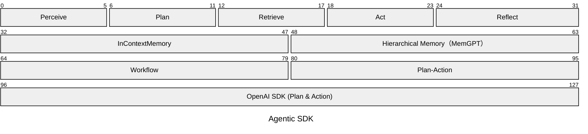
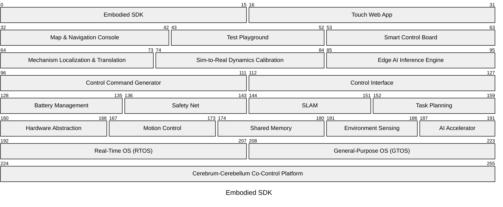

# Markov Chen

### AI R&D Architect & Developer Advocate

💡 Bridging AI research, semiconductor innovation, and robotics intelligence across **MediaTek**, **AMD**, and **NVIDIA** platforms. Helping enterprises seamlessly deploy AI solutions on **embedded systems**, **workstations**, and the **cloud**.

* [MediaTek Genio Series](https://github.com/R300-AI/MTK-genio-demo.git)
* [AMD Ryzen AI Series](https://github.com/R300-AI/amd-ryzen-ai-benchmark)
* [NVIDIA Jetson Series](https://github.com/R300-AI/NVDA-jetson-demo)

At ITRI, I act as a bridge between the developer community and product teams—translating product value to external developers and bringing their feedback back to shape **technical roadmaps**. I also build repositories and demo apps to help developers get started more easily. To see my commercial outcomes and case studies, please visit [ITRI AI Hub](ai-hub-portal.azurewebsites.net/home) website.

## Agentic SDK

Since 2023, 
 
famous while scaling law bring us magical tricky point. from context engineering, low-rank fine tuned, retrieval, toolcalling to harness engineering. all of the thecnologies tell us commercial used AI cannot just rely on weight

companies have been racing toward systems that approach AGI, and this SDK tracks the open-source models, chips, and agent harnesses I draw on for that work. The stack below separates model access, orchestration, memory, and function nodes into four independent layers.

I responsible for sovereign AI. That build a Hub for collecting both Descrimativ AI and Generative AI [**Agentic-SDK**](https://github.com/R300-AI/Agentic-SDK)

Bottom to top: the **model interface** layer standardizes how the workflow calls any model, so inference can run against a chosen endpoint without changing the layers above it. The **orchestration** layer owns execution state, decides the next step, and manages how a run advances or ends. The **memory** layer carries conversation context across turns and stores retrievable long-term experience. The **function-node** layer handles input understanding, next-step decisions, data retrieval, responses and tool actions, and checking results to re-plan. Keeping model connectivity, execution control, context retention, and agent behavior in separate layers means any one layer's strategy can be swapped without touching the others' responsibilities.

Reference hardware I target for this stack:

## Embodied SDK

The physical-AI counterpart to the Agentic SDK — this is where planning decisions turn into motor commands under real energy, safety, and spatial constraints, covering everything from perception to actuation on real hardware.

Four layers split responsibility from operation down to execution. The **interface** layer lets developers and field operators create, observe, and run tasks. The **core tools** layer provides shared positioning, calibration, and edge-compute capabilities that everything above draws on. The **domain application** layer turns operational intent into control decisions, constrained by energy, safety, spatial state, and mission goals. The **infrastructure** layer provides device access, real-time execution, sensing, and compute so the upper layers can run on physical hardware. Each layer keeps to its own boundary — the interface layer doesn't make domain decisions, core tools doesn't set mission goals, the domain layer doesn't implement hardware drivers, and infrastructure doesn't own user workflows. Data formats between modules, call order, the technology stack, hardware protocols, and benchmark targets are still open, pending industry comparison and finalized module specs.

## About This Account

This account collects my work on software development, system design, and technical documentation — currently centered on software architecture and maintainability, workflow automation, and using clear documentation to support team collaboration. Selected projects and technical notes will be added to public repositories here over time.
