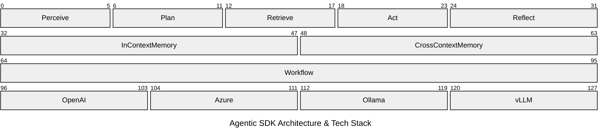
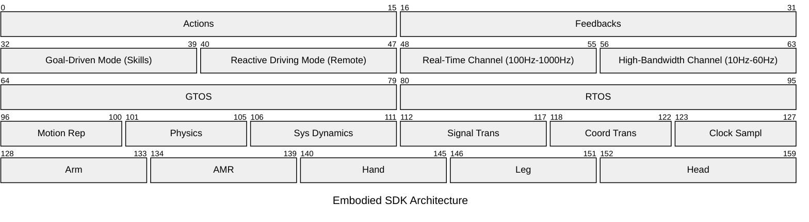

# Markov Chen

### AI R&D Architect & Developer Advocate

💡 Bridging AI research, semiconductor innovation, and robotics intelligence across **MediaTek**, **AMD**, and **NVIDIA** platforms. Helping enterprises seamlessly deploy AI solutions on **embedded systems**, **workstations**, and the **cloud**.

* [MediaTek Genio Series](https://github.com/R300-AI/MTK-genio-demo.git)
* [AMD Ryzen AI Series](https://github.com/R300-AI/amd-ryzen-ai-benchmark)
* [NVIDIA Jetson Series](https://github.com/R300-AI/NVDA-jetson-demo)

At ITRI, I act as a bridge between the developer community and product teams—translating product value to external developers and bringing their feedback back to shape **technical roadmaps**. I also build repositories and demo apps to help developers get started more easily. To see my commercial outcomes and case studies, please visit [ITRI AI Hub](ai-hub-portal.azurewebsites.net/home) website.

## Agentic SDK

To enable **AI agents** from the community to **deploy directly on diverse silicon solutions**, I proposed a [**framework**](https://github.com) that allows niche innovations to rapidly prove their concepts by leveraging public open-source techniques, significantly cutting down the overall R&D cycle.



This architecture **eliminates reinventing the wheel** to build a complete system from scratch, allowing developers to focus exclusively on innovating within any single module shown above. For instance, hardware innovators can test their chips using our ready-made upper layers, and software developers can plug in a new planning or memory mechanism without building the underlying infrastructure., as demonstrated in the implementation below.

```python
from agentic_sdk import Workflow
from agentic_sdk.audio.realtime import RealtimeTranscription
from agentic_sdk.modules import (
    NextStepWithSkills, PlanCheckReflect, SemanticRetrieve, ToolCallAction, VoiceTextPerceive,
)

endpoint = {"api_key": "ollama", "base_url": "http://localhost:11434/v1/", "model": "qwen3.8:27b"}
listener = RealtimeTranscription(api_key=..., base_url=..., model=...)

workflow = Workflow(
    perceive=VoiceTextPerceive(transport=listener),
    plan=NextStepWithSkills(skill_packages="path/to/skill-package", **endpoint),
    retrieve=SemanticRetrieve(sources=["path/to/knowledge.md"], **embedding),
    reflect=PlanCheckReflect(**endpoint),
    action=ToolCallAction(**endpoint, tools=[{
        "type": "function",
        "function": {...},
    }]),
)

result = workflow.run("What's your name?")
print(result.final_message)
```

In practice, the unified **Workflow** connects the upper `VoiceTextPerceive`, `SemanticRetrieve`, and **MemGPT** modules into a single control pipeline. This pipeline directly drives the local `Ollama` or `vLLM` endpoints, allowing the underlying silicon platform to execute these software functions as model inference.

## Universal Embodied SDK



## Harnesy

* [Office A+ Writer]()
* [AutoResearch]()

## About This Account

This account collects my work on software development, system design, and technical documentation — currently centered on software architecture and maintainability, workflow automation, and using clear documentation to support team collaboration. Selected projects and technical notes will be added to public repositories here over time.
