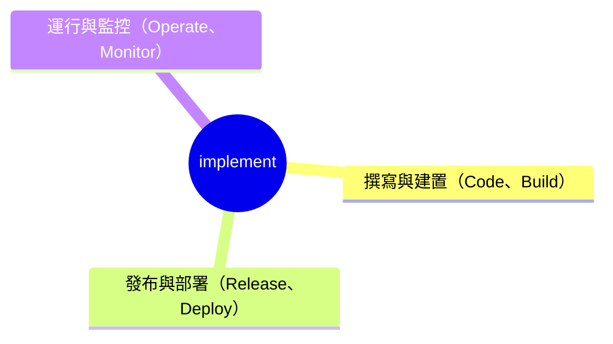

# implement

`implement` 底下的結構固定如下：

使用者要求新增、修改或修正程式碼時觸發。異動的是程式碼邏輯本身、或把它組裝成可執行產物，屬於撰寫與建置；異動的是把已經建置好的產物送出版本、送進部署環境，屬於發布與部署；異動的是已上線系統的運行狀態、監控告警或異常處理，屬於運行與監控。判斷落在哪一階後，依下表對應的 SOP 執行：

| 階段 | 對應 SOP |
| --- | --- |
| 撰寫與建置（Code、Build） | `instructions/code-build.instructions.md` |
| 發布與部署（Release、Deploy） | 待建立——由 `plan` 確認專案的發布部署方式後再建立 |
| 運行與監控（Operate、Monitor） | 待建立——由 `plan` 確認專案的監控告警方式後再建立 |
