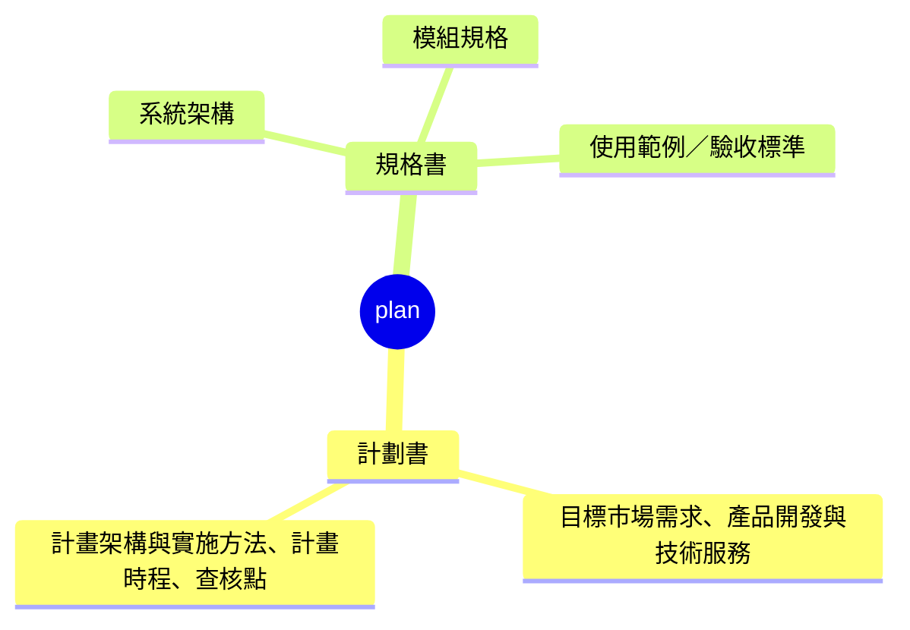

# plan

`plan` 底下的結構固定如下：

內容是市場、預算、時程這類商業提案，屬於計劃書；內容是整個專案的技術總覽、單一模組的介面與行為細節、或單一使用者操作流程的驗收條件，都屬於規格書。這個 skill 底下所有對應文件，都要先遵照 `instructions/plan.instructions.md` 的技能通用準則，再依下表對應的方式執行：

### 計劃書

| 段落 | 對應文件 | 協作方式 | 職責名稱 | 產出路徑 |
| --- | --- | --- | --- | --- |
| 目標市場需求、產品開發與技術服務 | `plan-ideation.prompt.md` | 問答步驟 | 市場需求與技術定位 | `<專案資料夾>/.github/proposals/ideation.md` |
| 計畫架構與實施方法、計畫時程、查核點 | `plan-action-items.prompt.md` | 問答步驟 | 計畫執行規劃 | `<專案資料夾>/.github/proposals/action-items.md` |

### 規格書

| 段落 | 對應文件 | 協作方式 | 職責名稱 | 產出路徑 |
| --- | --- | --- | --- | --- |
| 系統架構 | `plan-architecture.prompt.md` | 問答步驟 | 系統架構設計 | `<專案資料夾>/.github/specs/architecture.md` |
| 模組規格 | `plan-module-spec.prompt.md` | 問答步驟 | 模組規格設計 | `<專案資料夾>/.github/specs/modules.md` |
| 使用範例／驗收標準 | `plan-examples.prompt.md` | 問答步驟 | 使用流程驗收設計 | `<專案資料夾>/.github/specs/examples.md` |

同一列合寫的多段，各自能不能拆開單獨處理，依對應文件內部的說明為準，不在這裡重複。「寫入段落」與「產出路徑」兩欄是各對應文件的規範值，prompt 文件若與此表不一致，以此表為準更新 prompt。
