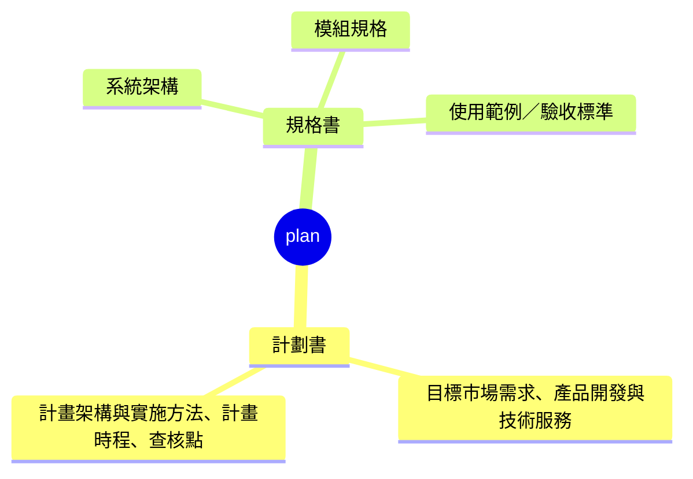

# plan

`plan` 底下的結構固定如下：

內容是市場、預算、時程這類商業提案，屬於計劃書；內容是整個專案的技術總覽、單一模組的介面與行為細節、或單一使用者操作流程的驗收條件，都屬於規格書。判斷落在哪個段落後，依下表對應的 SOP 執行：

| 文件種類 | 段落 | 對應 SOP | 主動作段落 | 寫入段落 | 產出路徑 |
| --- | --- | --- | --- | --- | --- |
| 計劃書 | 目標市場需求、產品開發與技術服務 | `plan-proposal-narrative.prompt.md` | 問答步驟 | 寫入計劃書（敘述段落） | `.github/proposals/<name>.md` |
| 計劃書 | 計畫架構與實施方法、計畫時程、查核點 | `plan-proposal-schedule.prompt.md` | 問答步驟 | 寫入計劃書（圖表段落） | `.github/proposals/<name>.md` |
| 規格書 | 系統架構 | `plan-overview.prompt.md` | 第一階段 + 第二階段 | 寫入系統架構 | `.github/specs/overview.md` |
| 規格書 | 模組規格 | `plan-module-spec.prompt.md` | 問答步驟 | 寫入規格書 | `.github/specs/<layer>/<module>.md` |
| 規格書 | 使用範例／驗收標準 | `plan-usage-example.prompt.md` | 問答步驟 | 寫入驗收標準 | `.github/specs/usage-examples/<flow>.md` |

同一列合寫的多段，各自能不能拆開單獨處理，依對應 SOP 內部的說明為準，不在這裡重複。「寫入段落」與「產出路徑」兩欄是各 SOP 的規範值，prompt 文件若與此表不一致，以此表為準更新 prompt。
