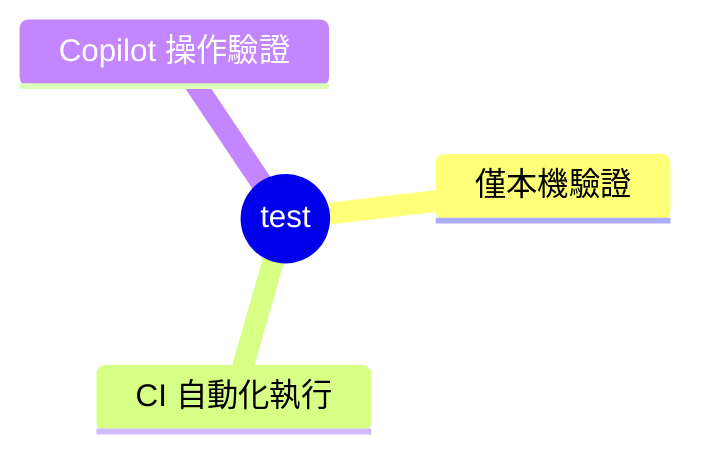

# test

`test` 底下的結構固定如下：

使用者要求新增、執行或更新測試時觸發。要驗證的內容只能接上實體硬體、在本機執行，搬不進 CI，屬於僅本機驗證；要驗證的是核心邏輯或跨模組整合在異動過程中有沒有壞掉、需要每次異動都有紀律地自動執行，屬於 CI 自動化執行；要驗證的是使用者實際操作瀏覽器或 App 的體驗、只能由 Copilot 親自扮演操作者跑一遍，屬於 Copilot 操作驗證。判斷落在哪一類後，依下表對應的 SOP 執行：

| 分類 | 對應 SOP |
| --- | --- |
| 僅本機驗證 | `.github/instructions/infra-test.instructions.md` |
| CI 自動化執行 | `.github/instructions/ci-test.instructions.md` |
| Copilot 操作驗證 | `.github/instructions/operations-test.instructions.md` |

`units`、`modules`、`operations` 三類的數量分配依測試金字塔原則遞減，詳細比例與理由見 `ci-test.instructions.md` 的「測試金字塔」段落。
