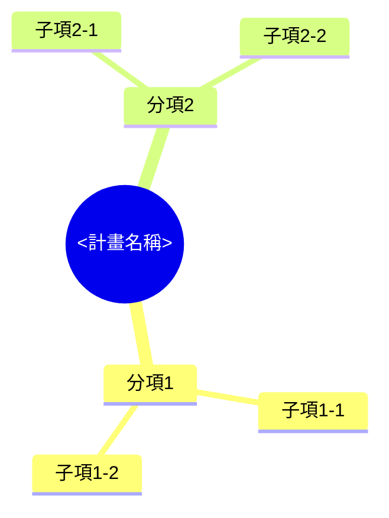

# <計畫名稱> 計劃書（圖表段落）撰寫模板

依 `.github/instructions/proposal-schedule-format.instructions.md` 的格式規則使用；產出寫入 `<專案資料夾>/.github/proposals/<name>.md` 的對應段落。角括號內是要填寫的內容說明，不是實際文字；三段內容環環相扣，分項子項名稱與里程碑代號要三段互相對得起來，不能各自獨立填寫。

## 計畫架構與實施方法

<架構圖之後，逐一分項說明實施方法：這個分項要做什麼、依賴哪些子項完成、由誰負責。每個子項至少交代做法本身、用到的關鍵技術或資源、預期達成的具體結果——不是條列式的職稱名詞，要具體到看得出實際的研發或執行動作。分項與子項數量依實際計畫拆解結果決定，不限於範本畫的數量。>

## 計畫時程

| 進度工作項目 | 權重% | 投入人月 | <年度1> |  |  | <年度2> |  |  |  |
| --- | --- | --- | --- | --- | --- | --- | --- | --- | --- |
|  |  |  | <Q1> | <Q2> | <Q3> | <Q1> | <Q2> | <Q3> | <Q4> |
| 分項1 | <%> |  |  |  |  |  |  |  |  |
| 分項1／子項1-1 |  | <人月> | <代號> |  |  |  |  |  |  |
| 分項1／子項1-2 |  | <人月> |  | <代號> |  |  |  |  |  |
| 分項2 | <%> |  |  |  |  |  |  |  |  |
| 分項2／子項2-1 |  | <人月> |  |  | <代號> |  |  |  |  |

<「權重%」欄只在分項列填，全部分項合計要等於 100%。年度／季度欄位依計畫實際起訖時間展開，不限於範本的 2 個年度。里程碑代號放在該子項預定完成的月份欄位，代號規則見下方「查核點」。>

## 查核點

| 查核點編號 | 預定完成時間（年/月） | 查核點內容 | 參與人員編號 |
| --- | --- | --- | --- |
| <A1> | <年/月> | <具體到能直接判斷達到或沒達到的技術指標或規格，例如「承載重量達 1,000kg」，不是「機構穩定」> |  |
| <A2> | <年/月> | <同上，換這個子項對應的具體指標> |  |
| <B1> | <年/月> | <同上> |  |

<代號依分項分配英文字母（分項1 用 A、分項2 用 B），字母底下依完成時間先後編號；代號要對照「計畫時程」表格裡填的位置，同一個代號只出現在時程表的一個月份欄位。查核點數量依實際子項與里程碑數量決定，不強制固定數量；結案當月所屬分項要有一個驗收用查核點。「參與人員編號」欄視專案是否有對應的人員清單決定要不要填。>
