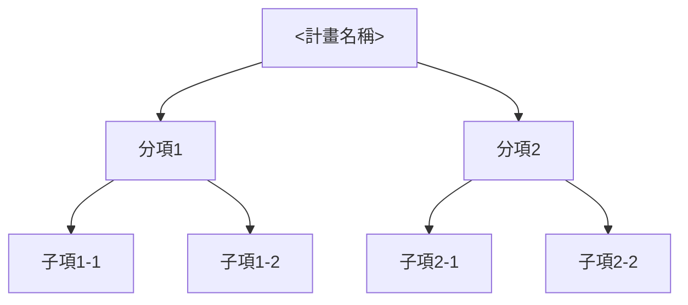

# <計畫名稱> 計劃書（敘述段落）撰寫模板

依 `.github/instructions/proposal-format.instructions.md` 的格式規則使用；產出寫入 `<專案資料夾>/.github/proposals/<name>.md` 的對應段落。角括號內是要填寫的內容說明，不是實際文字。

## 目標市場需求

<具體寫出這個計畫鎖定的使用者是誰、他們目前有什麼沒被滿足的需求；每個痛點依「現況怎麼運作」「這個現況造成什麼具體後果」兩層說明，不是只列痛點名稱。痛點之間如果有因果或加乘關係（例如人力短缺導致效率低落、進而限制擴張速度），要交代清楚彼此的關聯。這個需求有多急迫、多普遍要有具體依據（例如受影響的人數或案例數、發生頻率、既有做法的失敗率或事故紀錄），依據要能回答「這個技術問題有多嚴重」，不是「這個市場值多少錢」——市場規模、營收機會、競爭定位屬於企業經營資訊，不在技術規劃書的範圍內，這裡不寫。>

## 產品開發與技術或服務說明

### 產品開發或服務說明

<這個計畫要開發的產品或服務整體是什麼、解決「目標市場需求」段落點出的哪些痛點、採用哪些關鍵技術元件（列出技術元件名稱與各自解決的問題，細節留給下一小節展開）。>

這個產品或服務的組成，如下圖：

<讀圖指引：由左而右先看計畫整體，再看各分項，最後看各分項底下的子項。分項與子項的名稱、數量要跟「計畫架構與實施方法」段落（`action-items.md`）用的完全一致，兩份文件才能互相對照：兩份哪份先寫，由先寫的那份定案分項與子項，後寫的那份直接沿用，不重新拆分。這張圖的結構固定（計畫名稱→分項→子項三層），每次撰寫都用這個結構，不套用下面「關鍵技術或服務應用情境說明」的選圖規則。>

### 關鍵技術或服務應用情境說明

<以使用者實際操作的情境（誰、在什麼狀況下、做什麼、系統怎麼回應）依序說明這個產品或服務怎麼被使用；情境數量依產品實際的功能模組決定，每個情境對應一段具體的操作流程，不是抽象描述系統能力。>

<每個情境依 `plan.instructions.md`「圖表類型的選用規則」，依這個情境的內容性質（互動順序、決策流程等）挑一種對應的 Mermaid 圖表類型畫出來，圖後接一段讀圖指引；情境性質不同時，各情境可以用不同的圖表類型，不強制全部統一。>

### 功能規格（技術指標）或服務模式（驗證指標）

<這個產品或服務要達到的具體量化指標，分兩類列出：
- 技術指標：可以直接量測的規格（例如處理延遲、辨識準確率、承重上限），每項都附數字與量測方式。
- 驗證指標：要透過場域或市場驗證才能確認的效果（例如作業效率提升幅度、人力縮減比例），每項都附驗證方式與判定門檻。
不能只寫「效能提升」「品質更好」這類沒有量測基準的講法。>

---

完成這份文件後，判斷性詞（例如「市場很大」「效果顯著」）都已換成陳述依據的講法，讀者不看系統或程式碼、只憑這份文件就能判斷市場需求是否成立、技術方案是否可信。
