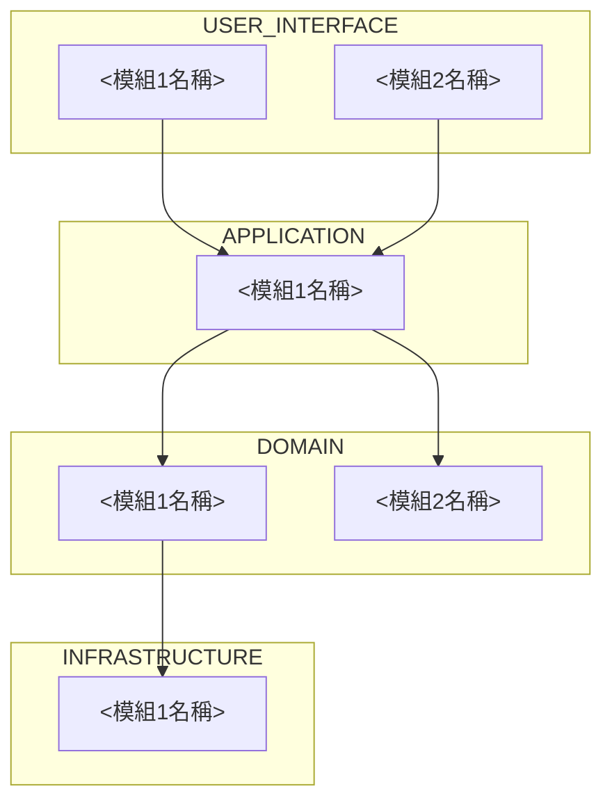

# 系統架構撰寫模板

依 `.github/instructions/spec-format.instructions.md` 的「系統架構」規則使用；產出寫入 `<專案資料夾>/.github/specs/overview.md`。角括號內是要填寫的內容說明，不是實際文字。

# 系統架構

<開場段落，交代目標使用者，只寫一次：是誰（具體的角色或客群，不是空泛的「使用者」，例如「門市 1～3 家規模的餐飲店長」，不是「中小企業主」）、要完成什麼（這個目標後續會對應到「使用範例／驗收標準」要驗證的使用者旅程）、使用情境的限制（裝置、環境、技術熟悉度等會影響介面設計與測試涵蓋範圍的限制條件）。整個系統的模組與跨層引用關係，如下圖。>

<讀圖指引：由上而下依序是使用者介面層、應用層、領域層、基礎設施層；箭頭方向就是引用方向，只能上層指向下層；每個節點的實際用途與互動細節，見下方對應層級的段落。>

## 使用者介面層

<用文字段落交代這層：主要使用的技術堆疊、參考或依附的 Benchmark 開源專案庫與為什麼參考、這層服務的對象（架構內部誰服務誰的關係，不是整個系統的目標使用者）、每個模組的用途與跨層互動關係。模組名稱第一次出現時用粗體標示並附連結指到該模組的規格位置。例如：「這層主要採用 <技術堆疊>，參考 <Benchmark 專案> 的做法，因為 <理由>；服務對象是 <這層的服務對象>。**[UI_module1](連結)** 負責<實際做什麼>，對應<存在原因>；因為<為什麼需要>，呼叫下層的 **APP_module1** 取得<資料或控制流向>。**[UI_module2](連結)** 負責<實際做什麼>，同樣依賴 **APP_module1** 的<能力>。這層明確不處理<明確排除的範圍>。」段落結構比照學術論文寫作的嚴謹度：主旨句在前，細節逐步展開，一段一主題。>

## 應用層

（寫法同上）

## 領域層

（寫法同上）

## 基礎設施層

（寫法同上）
