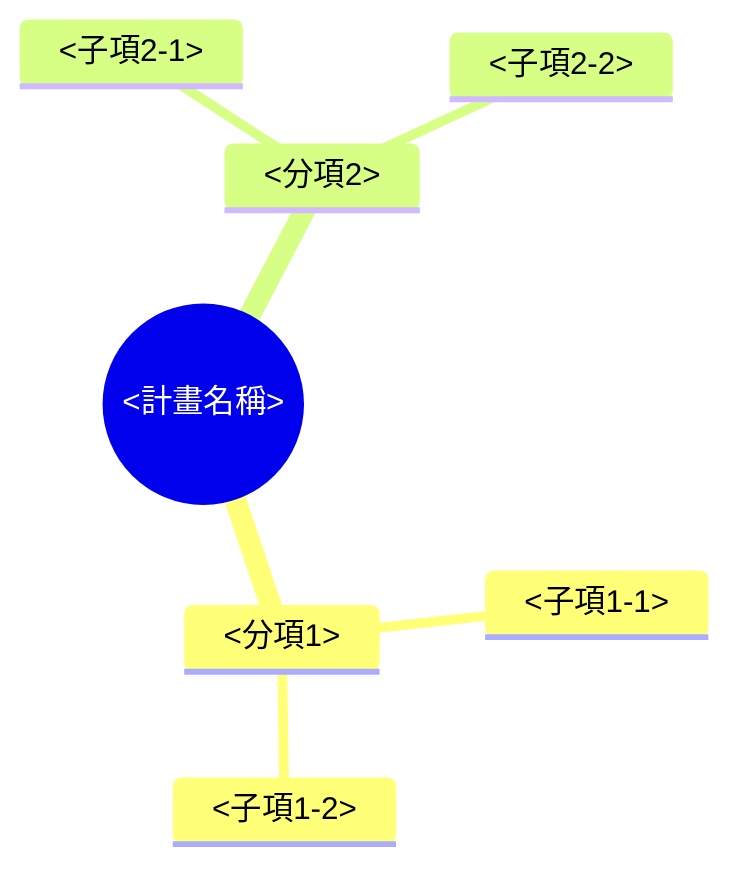

# <計畫名稱>

## 目標市場需求

<!-- 具體寫出：
     (1) 鎖定的使用者或客群是誰（具體角色，例如「門市 1–3 家規模的餐飲店長」）
     (2) 他們目前有什麼沒被滿足的需求
     (3) 需求的規模或急迫性的依據（數據、訪談紀錄、競品缺口）
     判斷性詞（「市場很大」）一律換成陳述依據的講法（「同類產品去年成長 40%，目前還沒有廠商鎖定這個客群」）。 -->

## 產品開發與技術服務

<!-- 具體寫出：
     (1) 要開發的產品或服務範圍
     (2) 預計採用的技術方案——每個方案附上為什麼選這個方案，不只列方案名稱
     (3) 跟既有產品或服務的差異 -->

## 計畫架構與實施方法

<!-- mindmap 根節點是計畫名稱，2–3 個分項，每個分項 2–3 個子項。
     分項子項名稱要與下方「計畫時程」「查核點」完全一致。 -->



<!-- 架構圖之後，逐一分項說明實施方法：這個分項要做什麼、依賴哪些子項完成、由誰負責。 -->

## 計畫時程

<!-- gantt 的 section 對應架構圖的分項，任務對應子項；子項名稱與時間要與查核點表格互相對照。 -->

```mermaid
gantt
    dateFormat  YYYY-MM-DD
    title 計畫時程
    section <分項1>
    <子項1-1> :a1, YYYY-MM-DD, Xd
    <子項1-2> :a2, after a1, Xd
    section <分項2>
    <子項2-1> :a3, YYYY-MM-DD, Xd
    <子項2-2> :a4, after a3, Xd
```

## 查核點

<!-- 每個分項每年固定 4 個查核點；
     內容欄標明類型（技術指標／產品規格／品質指標／市場測試指標）並附具體通過條件。 -->

| 分項／子項名稱 | 預定完成時間 | 查核點內容 |
|---|---|---|
| <分項1>／<子項1-1> | YYYY-MM-DD | <!-- 類型：具體通過條件 --> |
| <分項1>／<子項1-2> | YYYY-MM-DD | <!-- 類型：具體通過條件 --> |
| <分項1>／<子項1-2> | YYYY-MM-DD | <!-- 類型：具體通過條件 --> |
| <分項1>／<子項1-2> | YYYY-MM-DD | <!-- 類型：具體通過條件 --> |
| <分項2>／<子項2-1> | YYYY-MM-DD | <!-- 類型：具體通過條件 --> |
| <分項2>／<子項2-2> | YYYY-MM-DD | <!-- 類型：具體通過條件 --> |
| <分項2>／<子項2-2> | YYYY-MM-DD | <!-- 類型：具體通過條件 --> |
| <分項2>／<子項2-2> | YYYY-MM-DD | <!-- 類型：具體通過條件 --> |
