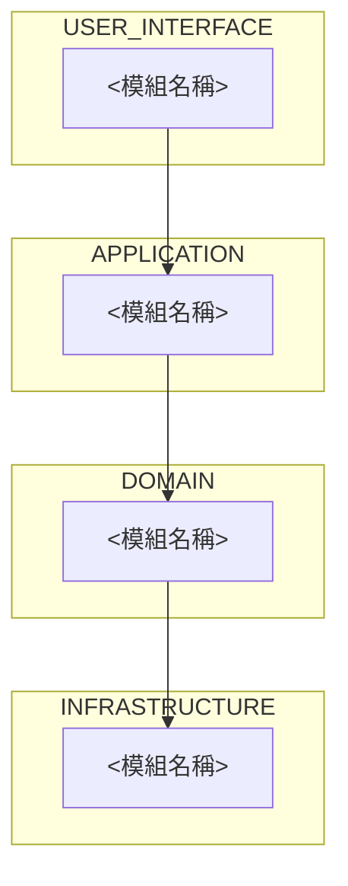

# 系統架構

<!-- 開場段落：
     (1) 是誰——具體的角色或客群，例如「門市 1–3 家規模的餐飲店長」，不是「中小企業主」
     (2) 要完成什麼——使用這個系統的主要目標；後續對應「使用範例／驗收標準」要驗證的旅程
     (3) 使用情境的限制——裝置、環境、技術熟悉度等影響介面設計與測試涵蓋範圍的限制條件
     整個系統的模組與跨層引用關係，如下圖。 -->

<!-- 讀圖指引：由上而下依序是使用者介面層、應用層、領域層、基礎設施層；箭頭方向就是引用方向，只能上層指向下層；每個節點的實際用途見下方各層段落。 -->

## 使用者介面層

<!-- 依序交代：
     - 主要技術堆疊
     - 參考或依附的 Benchmark 開源專案庫與為什麼參考
     - 這層服務的對象（架構內部誰服務誰，非整個系統的目標使用者）
     - 每個模組的用途與跨層互動關係（模組名稱第一次出現用粗體並附連結指到規格位置）
     - 這層明確不處理的範圍（以正向敘述方式改寫，例如「<職責> 由 <模組名稱> 接手」） -->

## 應用層

<!-- 同上 -->

## 領域層

<!-- 同上 -->

## 基礎設施層

<!-- 同上 -->
